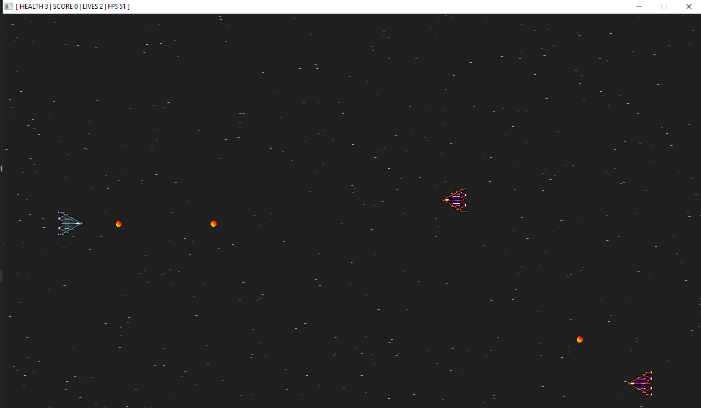
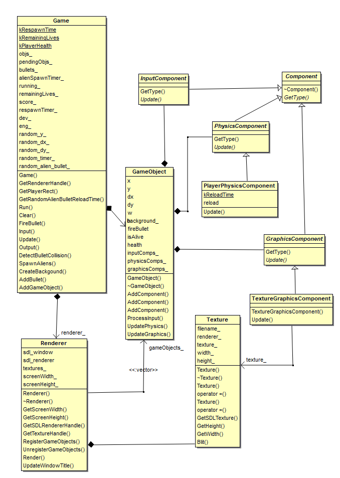

# CPPND: Capstone 2D Shoot 'em up Game

Based on the Snake game starter repo for the Capstone project in the [Udacity C++ Nanodegree Program](https://www.udacity.com/course/c-plus-plus-nanodegree--nd213).

The game is based on the [2D Shoot 'Em Up Parallel Realities tutorial](https://www.parallelrealities.co.uk/tutorials/shooter/shooter1.php). It has a game loop and implements the [component pattern](https://gameprogrammingpatterns.com/component.html).

### Playing
After start use the arrow keys to navigate and the left 'Ctrl' key to shoot.
If your health go to 0, wait a couple of seconds to respawn.
If you have no lives left press the space bar to play again.

It is kept very simple. There are no special effects if an an alien or the player gets hit. They only disappear.
The aliens spawn at random time and at random speed and of course they shoot at you.
But be careful: The aliens aim directly at you.
Your Health, Lives and Score are displayed in the windows title bar.

## Rubrics
In the code some rubrics are marked with a "// RUBRIC:" comment.
  * The project demonstrates an understanding of C++ functions and control structures.
    * Almost everywhere in the source code
  * The project accepts user input and processes the input.
    * File 'game.cpp' line 122
  * The project uses Object Oriented Programming techniques.
    * Almost everywhere in the source code
  * Classes use appropriate access specifiers for class members.
    * 'texture.h'
    * 'render.h'
    * 'texture.h'
    * etc.
  * Class constructors utilize member initialization lists.
    * e.g. 'texture.cpp' line 10
    * 'game_components.cpp' line 163
  * Classes abstract implementation details from their interfaces.
    * e.g. 'texture.h'
  * Classes encapsulate behavior.
    * e.g. 'texture.h'
  * Classes follow an appropriate inheritance hierarchy.
    * 'component.h'
    * 'game_components.h'
    * 'game_object.h'(Composition is used instead of inheritance when appropriate)
  * Overloaded functions allow the same function to operate on different parameters.
    * 'game_object.h' line 30
  * Derived class functions override virtual base class functions.
    * 'component.h' line 17
    * 'game_components.h'
  * Templates generalize functions in the project.
    * 'utility.h' line 12
  * The project makes use of references in function declarations.
    * 'utility.h line 19
    * 'component.h' line 29 & 36
  * The project uses destructors appropriately.
    * 'texture.cpp' line 27
  * The project uses scope / Resource Acquisition Is Initialization (RAII) where appropriate.
    * 'texture.cpp'
  * The project follows the Rule of 5.
    * 'texture.h', 'texture.cpp'
  * The project uses smart pointers instead of raw pointers.
    * 'game_object.h' line 41
    * 'game.cpp' e.g. line 42 ff.

## Structure
Class diagramm (missing some classes):

## Dependencies for Running Locally
* cmake >= 3.7
  * All OSes: [click here for installation instructions](https://cmake.org/install/)
* make >= 4.1 (Linux, Mac), 3.81 (Windows)
  * Linux: make is installed by default on most Linux distros
  * Mac: [install Xcode command line tools to get make](https://developer.apple.com/xcode/features/)
  * Windows: [Click here for installation instructions](http://gnuwin32.sourceforge.net/packages/make.htm)
* SDL2 >= 2.0
  * All installation instructions can be found [here](https://wiki.libsdl.org/Installation)
  * Note that for Linux, an `apt` or `apt-get` installation is preferred to building from source.
* SDL2_image >= 2.0
  * All installation instructions can be found [here](https://www.libsdl.org/projects/SDL_image/)
  * Note that for Linux, an `apt` or `apt-get` installation is preferred to building from source.
* gcc/g++ >= 5.4
  * Linux: gcc / g++ is installed by default on most Linux distros
  * Mac: same deal as make - [install Xcode command line tools](https://developer.apple.com/xcode/features/)
  * Windows: recommend using [MinGW](http://www.mingw.org/)

## Basic Build Instructions

1. Clone this repo.
2. Make a build directory in the top level directory: `mkdir build && cd build`
3. Compile: `cmake .. && make`
4. Run it: `./SnakeGame`.